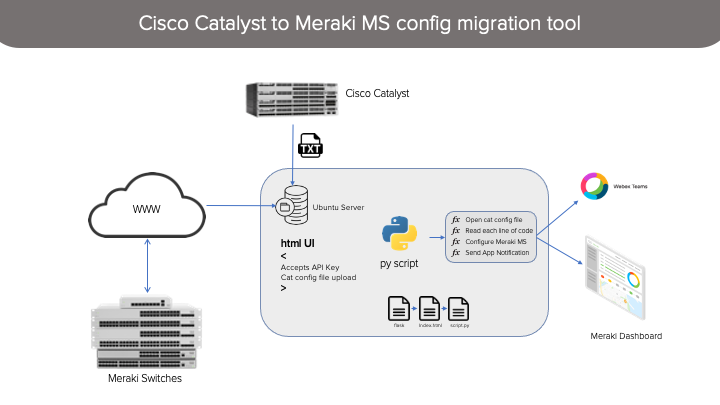
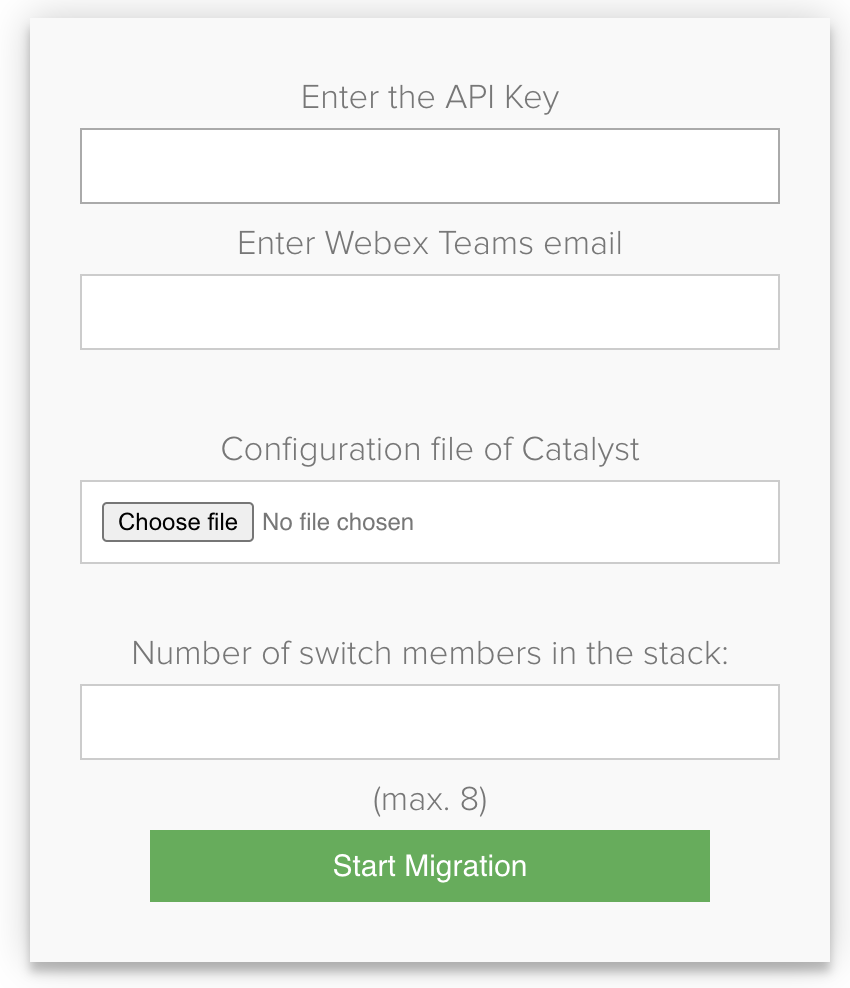

# Cisco Catalyst to Meraki MS Migration tool

This tool built to migrate Cisco Catalyst configuration of WC-29xx models to Meraki Switching line (MS). Currently, the tool is only covering the downlinks.  

Below is the list of configurations the tool can read and migrate:
- Switch stack configuration (up to 8 switches)
- Interface description
- Interface type (Access / Trunk)
- VLANS allowed through the trunk interfaces
- Data VLAN
- Voice VLAN
- Port security
- MAC whitelist
- Enable / disable ports

After the configuration pushed to Meraki dashboard, the script will send a Webex Teams message with the summary of configured ports and the ones are not.

## Solution Components



Once the python script is running, the below UI will be accessable to enter the required details to migrating the Catalyst configuration to Meraki MS. 



- [Webex Teams](https://developer.webex.com/)
- [Python 3](https://www.python.org/)
- [Flask](https://flask.palletsprojects.com/en/1.1.x/)

### Configuration

#### Obtain Meraki API key

Meraki API write Key is needed to allow the transfer of the configuration. Obtain Meraki API key [here](https://developer.cisco.com/meraki/api/#!authorization/obtaining-your-meraki-api-key).

#### Cisco Catalyst show run

A show run of the Cisco Catalyst configuration needs to be uploaded to the tool, so make sure to keep the latest copy saved and it needs to be in txt format.

#### `WEBEX_TEAMS_BEARER`

Webex Teams bot is needed to get notification after finishing the migration. Create one [here](https://developer.webex.com/docs/bots).

### Installation

1. Install python3 pip package
    ```bash
    $ sudo apt install python3-pip
    ```
2. Install packages from the requirements file.
    ```bash
   $ sudo pip3 install -r requirements.txt
    ```
3. Change the Webex Teams bearer in [`usr_info.py`](#usr_info.py).
4. Run the application 
    ```bash
   $ python3 app.py
    ```
    
### Use

From any browser enter http://ip_address:5000 or http://localhost:5000

[](https://developer.cisco.com/codeexchange/github/repo/fadysharobeem/Catalyst_to_Meraki_Migration_tool)
